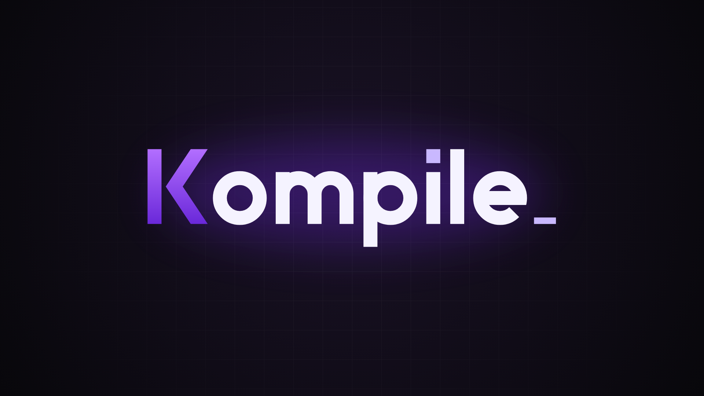
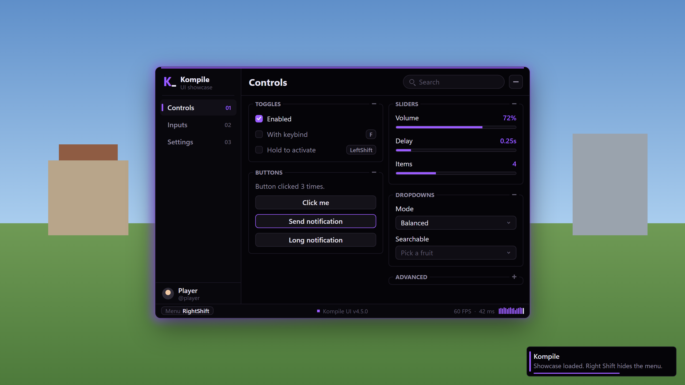

<p align="center">
  
</p>

<p align="center">A clean, modular Roblox script hub with its own UI library.</p>

## Load

```lua
loadstring(game:HttpGet("https://raw.githubusercontent.com/snapsnarvmorvid/Kompile/main/loader.lua"))()
```

Toggle the menu with **Right Shift** (rebind it in Settings). On mobile, tap the **K** button.

**Without GitHub:** paste `dist/kompile.lua` into your executor. It's the whole hub in one file, so nothing is downloaded from the repo. After changing anything in `src/`, `games/`, `scripts/` or `examples/`, rebuild it with `python tools/bundle.py`.

## Features

- **Home**: player, game, and executor info, plus a Discord invite button
- **Game**: per-game tools that load automatically when a module exists for the current game
- **Scripts**: a searchable library of scripts you register, run with one click
- **Utility**: FOV slider, fullbright (with an optional keybind), anti-AFK, rejoin, server hop, copy server ID
- **Settings**: menu keybind, accent color, UI scale, and saved configs per game with autoload
- Running it again replaces the open window instead of stacking a second one, and **Unload** undoes every change it made

## Requirements

- **To run it:** an executor with `loadstring` and `game:HttpGet`. Saving configs also needs the executor's file functions (`writefile`, `readfile`, `isfile`, `isfolder`, `makefolder`, `listfiles`); without them everything else still works.
- **To rebuild `dist/`:** Python 3, standard library only. There's nothing to install.

There are no other dependencies. The UI library is part of this repo.

## Setup

1. Keep the repo public and named `Kompile`, with the default branch `main` (the loader URL depends on all three).
2. Optional: in `src/main.lua`, set `Settings.Discord` to your invite.

## Project layout

```
loader.lua            entry point: fetches and starts src/main.lua
src/main.lua          builds the hub: tabs, features, settings
src/ui/Library.lua    Kompile UI, the UI library
games/registry.lua    universe ID -> game module
games/_template.lua   starting point for a new game module
scripts/registry.lua  scripts shown in the Scripts tab
examples/showcase.lua every UI element in one window
dist/                 standalone builds (no GitHub needed), made by tools/bundle.py
tools/bundle.py       rebuilds dist/
assets/               logo, banner and UI preview
```

## Kompile UI

<p align="center">
  
</p>

**Try it:** paste `dist/kompile-showcase.lua` into your executor. It has the library built in, so it runs without anything uploaded. After editing `src/ui/Library.lua` or `examples/showcase.lua`, rebuild it with `python tools/bundle.py`.

A compact UI library written for this hub, in the spirit of the classic hand-built menus:

- Near-black solid panels with soft rounded corners, a purple strip across the top, and a subtle purple glow that travels around the window.
- A numbered sidebar of tabs, and two columns of collapsible groupboxes whose titles sit in the border.
- Checkboxes that fill purple when on, keybind chips, and flat sliders.
- A pill search box that finds any control on any tab and jumps to it, plus a status bar with live FPS, ping and an FPS graph.
- One purple accent, changeable in Settings.

```lua
local Window = Library:CreateWindow({ Title = "Kompile", Footer = "v1.0.0", ToggleKey = "RightShift" })
local Tab = Window:AddTab("Main")
local Box = Tab:AddLeftGroupbox("Movement")

Box:AddToggle("Enabled", { Text = "Enabled", Default = false, Callback = function(on) end })
	:AddKeybind("EnabledKey", { Default = "F", Mode = "Toggle" })
Box:AddSlider("Amount", { Text = "Amount", Min = 0, Max = 100, Default = 50, Suffix = "%" })
Box:AddDropdown("Mode", { Text = "Mode", Values = { "A", "B" }, Default = 1, Searchable = true })
Box:AddInput("Name", { Text = "Name", Placeholder = "Type here", Finished = true })
Box:AddKeybind("Panic", { Text = "Panic key", Default = "End", Mode = "Press", Callback = function() end })
Box:AddButton({ Text = "Do thing", Func = function() end, Tooltip = "Explains the thing" })
Box:AddLabel("Plain text"):SetText("Changed text")
Box:AddDivider()

Library.Options.Amount:OnChanged(function(value) end)
Library.Options.Amount:SetValue(75)
Library:Notify("Title", "Message", 4)
Library:SetTheme({ Accent = Color3.fromHex("3ee6d0") })
Library:BuildSettingsTab(Window)
Library:OnUnload(function() end)
```

Every option with an id is saved in configs unless you pass `Save = false`.

## Adding a game

1. Run `print(game.GameId)` in the game to get its universe ID.
2. Copy `games/_template.lua` to `games/<game-name>.lua` and build your tools into `ctx.Tab`.
3. Register it in `games/registry.lua`:

```lua
return {
	[1234567890] = "games/<game-name>.lua",
}
```

## Adding a script

Add an entry to `scripts/registry.lua`:

```lua
{ Name = "My script", Description = "What it does.", Url = "https://raw.githubusercontent.com/..." },
```

Only list scripts you trust: they run with full executor access for everyone who uses the hub.
